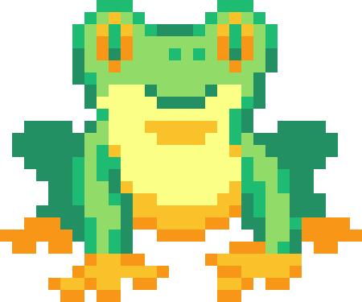

# Pixelate


Create amazing pixel art murals with sticky notes. Pixelate is a image editor that shows assembly guides to put art with sticky notes on your wall.

## Contributing

Please read [CONTRIBUTING](./CONTRIBUTING.md), then [open an issue](https://github.com/google/pixelate/issues/new) with your idea or pick an [unassigned issue](https://github.com/google/pixelate/issues?q=is%3Aopen+is%3Aissue+no%3Aassignee), and send a pull request with your changes.

## Development

1. Install the LTS version of [Node.js](https://nodejs.org/).
2. Clone this repository into a folder of your choice.
   ```
   git clone https://github.com/google/pixelate.git .
   ```
3. Install all NPM dependencies.
   ```
   npm install
   ```
4. Build the project and start a development web server.

   ```
   npm run start
   ```

5. Open http://localhost:4200/. The development web server automatically reloads after code changes. All code is automatically formatted and checked when committing.

## About



Pixelate is a community effort of pixel art lovers, not an officially supported Google product. The project is licensed under [Apache 2.0](./LICENSE). The tree frog logo was created by [Ota Jaider](https://twitter.com/ota_pixelart) for Pixelate.

Copyright 2021 [The Pixelate Authors](./AUTHORS)
